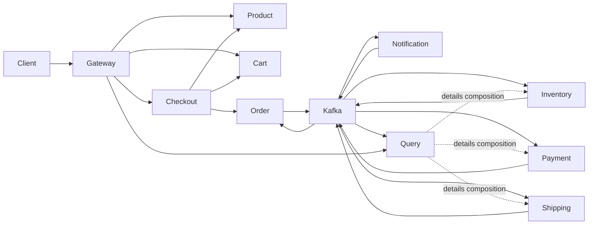

# Phase 1 — architecture and implementation contract

Status: phases 1–13 are implemented, including product/cart APIs, event-sourced orders,
transactional outbox publication, reservations, simulated payments/refunds, shipping,
compensation, notifications, CQRS projections, rebuilds and gateway routing. See [Phase 3](phase-3-product-cart.md),
[Phase 4](phase-4-order-outbox.md), [Phase 5](phase-5-inventory.md), [Phase 6](phase-6-payment.md), [Phase 7](phase-7-saga.md), [Phase 8](phase-8-projection.md)
and
[infrastructure](../infrastructure/README.md). The saga workflows below are implemented; remote order-details
composition is implemented in [Phase 9](phase-9-composition.md).
Circuit breakers and consumer dead-letter recovery are implemented in [Phase 10](phase-10-resilience.md).
JWT validation, HTTP/Kafka tracing and business metrics are implemented in [Phase 11](phase-11-security-observability.md).
The coverage map and packaged concurrency/outage verification are documented in [Phase 12](phase-12-verification.md).
The [Phase 13 walkthrough](phase-13-walkthrough.md) exercises all four order outcomes
and documents operational recovery. Checkout HTTP orchestration and safe cart clearing
remain unimplemented; the walkthrough uses an explicit trusted order handoff.

## Ownership and boundaries

| Module               | Port | Owned database  | Responsibility                                                              |
|----------------------|-----:|-----------------|-----------------------------------------------------------------------------|
| api-gateway          | 8080 | none            | Routing, JWT validation, correlation propagation; no business logic         |
| product-service      | 8081 | product_db      | Catalog, authoritative prices, product administration                       |
| cart-service         | 8082 | cart_db         | Customer-owned carts and quantities; displayed prices are not binding       |
| checkout-service     | 8083 | checkout_db     | Validate cart, obtain prices, persist request idempotency, submit order     |
| order-service        | 8084 | order_db        | Event-sourced order aggregate, legal transitions, order command idempotency |
| inventory-service    | 8085 | inventory_db    | Stock, versioned reservations and release                                   |
| payment-service      | 8086 | payment_db      | Simulated charges, provider reconciliation, refunds and idempotency         |
| shipping-service     | 8087 | shipping_db     | Shipment creation and tracking                                              |
| notification-service | 8088 | notification_db | Durable simulated notification delivery log                                 |
| order-query-service  | 8089 | query_db        | Replayable order projections and API composition                            |

One PostgreSQL container is sufficient for development. Each service gets a distinct
login owning only its database. No cross-database queries, foreign keys or shared JPA
entities. The gateway is stateless; a database or migration there would be artificial.
Redis is a disposable product display cache and gateway rate-limit store, never the
source of truth for stock, charge idempotency, or accepted checkout commands.



## Modules and packages

The root is a Maven aggregator and dependency manager, not a deployable application.
All ten applications have independent executable jars and Dockerfiles. Build each with
`./mvnw -pl product-service -am package`. Dockerfiles take the repository root as context.

`platform-contracts` contains only `Money` and `EventEnvelope<T>`. Producers own their
payload records and JSON schema fixtures. Consumers map the fields they need into local
records. Do not place repositories, entities, security configuration or saga state in
this library. Add service-local `api`, `application`, `domain`, and `infrastructure`
packages as functionality is introduced. Kafka listeners deserialize and delegate;
transactional application methods own decisions and persistence.

## Synchronous request path

1. Gateway validates JWT and propagates bearer identity and correlation ID. Customer
   identity comes from the token, never a trusted request-body customer ID. Services
   validate tokens and enforce resource ownership too. ADMIN owns catalog/stock APIs.
2. Checkout reads the customer's cart and authoritative catalog prices with bounded
   HTTP timeouts. Its resilience policy cannot invent a price or approve a payment.
3. Persist `(customer_id, idempotency_key, request_hash, order_id, status)` with a unique
   constraint. Reuse returns the same order ID; a different body returns 409. Concurrent
   inserts are resolved by the database, not a check-then-insert in Java.
4. Commit this checkout intent BEFORE calling order. Never hold a DB transaction open
   across HTTP. The generated order ID and persisted command are stable across retries.
5. Order accepts a unique checkout identity and immutable priced item snapshot, writing
   event store and outbox in one transaction. Lost HTTP replies are safe to retry.
6. Checkout records acceptance locally. A background recovery worker resumes pending
   intents after a crash. Return 202 with order ID and polling URL once accepted; query
   may return 404 until its first event arrives. Do not clear a mutable cart blindly:
   compare its submitted version before clearing so later additions are retained.

## Choreography, happy path

```mermaid
sequenceDiagram
    participant C as Checkout
    participant O as Order
    participant K as Kafka
    participant I as Inventory
    participant P as Payment
    participant S as Shipping
    participant Q as Query / Notification
    C->>O: Idempotent create command
    O->>O: TX: append OrderCreated + outbox
    O-->>C: 202 + order ID
    O->>K: Outbox: OrderCreated
    K->>I: OrderCreated
    I->>I: TX: reserve stock + inbox + outbox
    I->>K: InventoryReserved
    K->>P: InventoryReserved
    P->>P: Durable idempotent simulated charge
    P->>K: PaymentCompleted
    K->>S: PaymentCompleted
    S->>S: TX: shipment + inbox + outbox
    S->>K: ShipmentCreated
    K->>O: Inventory / payment / shipment facts
    O->>O: Append facts; complete only when prerequisites hold
    O->>K: OrderCompleted
    K->>Q: Update read model / record notification
```

## Compensation

```mermaid
sequenceDiagram
    participant O as Order
    participant K as Kafka
    participant I as Inventory
    participant P as Payment
    K->>P: InventoryReserved
    P->>P: Persist terminal decline + outbox
    P->>K: PaymentFailed
    K->>I: PaymentFailed
    I->>I: TX: release existing reservation exactly once
    I->>K: InventoryReleased
    K->>O: PaymentFailed / InventoryReleased
    O->>O: Append facts; verify failure and compensation
    O->>K: OrderCancelled
```

Inventory rejection emits InventoryReservationFailed; order cancels without a charge.
Shipping rejection after a successful charge emits ShipmentFailed. Payment reacts by
refunding with a stable refund key and emits PaymentRefunded. Inventory reacts to the
refund and releases stock. Order cancels only after both refund and release facts.
A failed refund remains COMPENSATING and needs recovery; it is never reported as cancelled.
Timeout means UNKNOWN, not DECLINED: reconcile provider state before issuing a new charge
or releasing stock. The simulated provider must persist outcomes keyed by payment identity
so response-loss scenarios can be tested without accidentally charging twice.

Requests such as PaymentRequested or InventoryReleaseRequested are optional contracts;
the primary flow uses facts directly so order does not become an orchestrator.
The order service observes facts to enforce its own aggregate invariants. It does not
send the next business step to another service.

## Topics and contracts

| Topic               | Producer     | Events                                                                          | Main consumers                    |
|---------------------|--------------|---------------------------------------------------------------------------------|-----------------------------------|
| order.events        | Order        | OrderCreated, OrderNoteAdded, OrderFactRecorded, OrderCompleted, OrderCancelled | Inventory, Query, Notification    |
| inventory.events    | Inventory    | InventoryReserved, InventoryReservationFailed, InventoryReleased                | Payment, Order, Query             |
| payment.events      | Payment      | PaymentCompleted, PaymentFailed, PaymentRefunded                                | Shipping, Inventory, Order, Query |
| shipping.events     | Shipping     | ShipmentCreated, ShipmentFailed                                                 | Payment, Order, Query             |
| notification.events | Notification | CustomerNotified                                                                | Query                             |

Use three partitions in development and replication factor one, explicitly not a
production durability configuration. Key every workflow record by order UUID. Event
aggregate ID identifies the producer's aggregate; payload includes orderId when different.
A topic per owning domain reduces topic proliferation. Event-type topics allow separate
retention/ACL policies but sacrifice ordering between types and increase operations.

Envelope: eventId, eventType, correlationId, causationId, aggregateType, aggregateId,
aggregateVersion, occurredAt, schemaVersion, traceparent, payload. The initial causationId
is the command/request UUID; successors use the triggering event ID. Retrying publication
preserves the event ID. Versions belong to ONE producer aggregate, not a global saga.
W3C traceparent carries trace/span context; structured logs extract traceId. Trace context
may be absent during offline replay, but business correlation and causation remain.

Payloads carry immutable order item/price snapshots or the information needed for the
next step. Never send card data. Fake demo tokens may be routed only to payment and must
not be logged. Shipment inputs are bounded synthetic demo addresses, with retention
and privacy considerations documented before using real customer data.

### Event evolution

For OrderCreated schema 1, absence of optional `salesChannel` means `WEB`. Adding that
field is backward compatible when consumers ignore unknown fields. Fixtures must prove
old readers accept the new payload and new readers apply the default to old payloads.
A renamed required field or changed monetary unit requires a new schema version and an
explicit upcaster. Preserve original append-only events; do not rewrite event history.

## Transaction, delivery and ordering invariants

* Business state, processed_event insertion, and outgoing outbox rows commit together.
  Insert the processed marker with conflict detection inside the transaction. A crash
  before commit permits retry; after commit, redelivery sees the marker and does nothing.
* Pollers publish pending rows, wait for Kafka acknowledgement, then mark published.
  A crash between acknowledgement and mark yields a duplicate. This is intentional
  at-least-once delivery; Kafka producer idempotence cannot remove this crash window.
* Polling concurrency must not allow event version N+1 to overtake N for one aggregate.
  Claim aggregate streams or only their oldest unpublished row. SKIP LOCKED alone over
  arbitrary rows is insufficient. Bounded batches and timeouts prevent unbounded backlog
  processing; monitor oldest pending row age and publication failure count.
* Kafka orders only within a topic partition. Identical keys across different topics
  DO NOT establish causal delivery order. Persist incoming facts, apply monotonic state
  transitions when prerequisites exist, and retain unapplied facts for later processing.
  A high version from payment must not suppress a lower version from inventory.
* Order appends use a unique `(aggregate_id, aggregate_version)` constraint and expected
  version comparison. Retry a conflict by reconstructing state and re-evaluating the
  command. A normal mutable order table is only an optional cache of reconstructed state.
* Inventory reserves all lines in one local transaction. `@Version` detects concurrent
  writers. On conflict retry the whole transaction with a fresh persistence context;
  recheck available quantity. If two buyers want the last unit, exactly one succeeds.
  A unique order reservation prevents double reservation even with distinct event IDs.
* Retry transient failures with bounded exponential backoff and jitter. Declines and
  invalid schemas are not transient. Consumer-specific DLTs avoid one consumer group
  interfering with another's recovery. Do not mark a failed business action processed.
  Confirm DLT publication before committing source offset. Redrive preserves event ID;
  fix the underlying cause first. Delayed retries may reorder events, so prerequisite
  handling must still apply. Permanent gaps require operational intervention, not success.

## Security, observability and API rules

Use environment-provided JWT signing material for a demo token issuer; production uses
an external issuer/JWKS. Expose only the gateway publicly. Actuator health is public;
metrics are internal. Do not enable secrets or stack traces in Problem Details. Bound
pagination, cart size, quantities and timeouts; apply Jakarta validation to DTOs.

Use Micrometer business counters plus Prometheus/Grafana, OTLP tracing to a collector,
and ECS JSON logs with service, traceId, correlationId, orderId, eventId and eventType.
Never use order/customer IDs as metric labels. Phase 11 explicitly wires
trace context through HTTP filters, outbox publishers and Kafka consumer interceptors.

Query serves an eventually consistent projection. Details composition runs bounded
parallel lookups against owner APIs; optional missing dependencies return explicit
availability fields, not fabricated success. Enforce customer ownership before fan-out.
A projection rebuild loads a new generation from persisted input history or order export,
then switches atomically. Kafka retention alone is not an unlimited event store.
