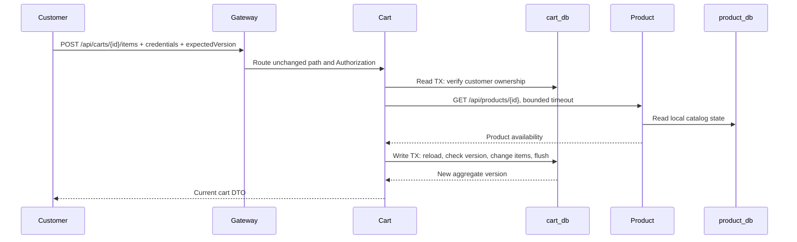

# Phase 3 — Product and Cart

Implemented and verified against PostgreSQL 17 with Spring Boot 4.0.8 / Java 21.
Product and cart are independent deployable applications with their own migrations,
repositories, DTOs, transaction boundaries, HTTP security and tests. The gateway now
routes these two APIs. Checkout and order creation are not implemented in this phase.

## Responsibilities and communication

Product owns SKU, name, description, active state and the authoritative USD price.
Cart owns a customer ID and product IDs/quantities. It never stores a binding product
price, accesses product_db, or reserves inventory. Products can change after an item
is added; checkout must obtain a fresh price and availability check before accepting
an order. This phase deliberately uses no Redis cache for authoritative validation.



`CartService` coordinates the HTTP boundary without `@Transactional`.
`CartTransactions` is a separate Spring bean so transaction interception applies to
its read and write calls. No DB connection is held while waiting on the catalog.
The write reloads the cart because it may have changed during that HTTP call.

## Directory structure

```text
product-service/src/main/
├── java/com/synechisveltiosi/productservice/
│   ├── api/                  ProductController, ProductDtos, ApiExceptionHandler
│   ├── application/          ProductService, ApiException
│   ├── domain/               Product
│   └── infrastructure/       ProductRepository, SecurityConfiguration
└── resources/
    ├── application.yml / application-demo.yml
    └── db/
        ├── migration/V1__product.sql
        └── demo/V2__demo_products.sql
cart-service/src/main/
├── java/com/synechisveltiosi/cartservice/
│   ├── api/                  CartController, CartDtos, ApiExceptionHandler
│   ├── application/          CartService, CartTransactions, ApiException
│   ├── domain/               Cart
│   └── infrastructure/       CartRepository, ProductCatalogClient, SecurityConfiguration
└── resources/db/migration/V1__cart.sql
api-gateway/src/main/resources/application.yml     product/cart routes
infrastructure/scripts/verify-catalog-cart.py      real routed API and outage checks
```

There are no Kafka listeners/producers for these local operations. Publishing catalog
or cart events would require an outbox and actual consumers; that wiring is not needed
for the primary saga, whose initial event is OrderCreated in Phase 4. Avoid adding
unreliable placeholder producers just to populate a package.

## Start and authenticate

```bash
python3 infrastructure/scripts/init-env.py
docker compose up -d --build --wait --wait-timeout 300
```

The environment initializer now appends missing keys while preserving existing
credentials, allowing an existing Phase 2 `.env` to be upgraded. Do not replace the
file or rotate database credentials when moving between phases.

Load this project's generated local environment into your shell:

```bash
set -a
source .env
set +a
CUSTOMER_ID=11111111-1111-1111-1111-111111111111
BASE_URL="http://localhost:${GATEWAY_PORT:-8080}"
```

The demo uses stateless HTTP Basic for curl clients with environment-supplied passwords:

| Username                               | Password variable               | Role     |
|----------------------------------------|---------------------------------|----------|
| `11111111-1111-1111-1111-111111111111` | `DEMO_CUSTOMER_PASSWORD`        | CUSTOMER |
| `22222222-2222-2222-2222-222222222222` | `DEMO_SECOND_CUSTOMER_PASSWORD` | CUSTOMER |
| `admin`                                | `DEMO_ADMIN_PASSWORD`           | ADMIN    |

Each service verifies credentials; cart ownership is derived from the authenticated
principal. Customers cannot set another customer's identity in a request. Cart queries
for someone else's cart return 404, including mutation attempts. ADMIN can manage the
catalog but is not a customer with implicit access to every cart.

Passwords are BCrypt-encoded when configuring the in-memory demo users. No password
has a source-code default. Basic credentials are forwarded to product over the internal
Compose network, so both services receive the same demo configuration. This is a local
curl-oriented authentication adapter: CSRF and sessions are disabled; it is not a
browser authentication design. JWT, issuer validation, gateway authentication and full
tracing are Phase 11 work. Health and Prometheus remain accessible for internal probes;
other Actuator endpoints require ADMIN. Only the gateway is published for application
traffic. Never use these plaintext demo credentials as production credentials.

## Browse seeded products

Compose activates the `demo` profile for product-service only. Flyway creates the
schema and inserts these products once:

| Product    | UUID                                 |     USD |
|------------|--------------------------------------|--------:|
| Laptop     | aaaaaaaa-aaaa-aaaa-aaaa-aaaaaaaaaaa1 | 1299.00 |
| Keyboard   | aaaaaaaa-aaaa-aaaa-aaaa-aaaaaaaaaaa2 |   79.90 |
| Monitor    | aaaaaaaa-aaaa-aaaa-aaaa-aaaaaaaaaaa3 |  299.00 |
| Headphones | aaaaaaaa-aaaa-aaaa-aaaa-aaaaaaaaaaa4 |  149.50 |

```bash
curl --fail -u "$CUSTOMER_ID:$DEMO_CUSTOMER_PASSWORD" \
  "$BASE_URL/api/products?page=0&size=20"

curl --fail -u "$CUSTOMER_ID:$DEMO_CUSTOMER_PASSWORD" \
  "$BASE_URL/api/products/aaaaaaaa-aaaa-aaaa-aaaa-aaaaaaaaaaa2"
```

List returns active products, sorted by name then UUID, with `items`, `page`, `size`,
`totalElements`, and `totalPages`. Page size is 1–100 and page index 0–10000. Get-by-ID
also returns inactive products so existing references can be inspected; cart admission
requires `active=true`. Product DTOs expose a `price` object with exact `amount` and
`currency`, never a floating-point domain value or a JPA entity.

## Create and modify a cart

The following commands use Python 3 to extract response fields without requiring jq.

```bash
CART_JSON=$(curl --fail -sS -u "$CUSTOMER_ID:$DEMO_CUSTOMER_PASSWORD" \
  -X POST "$BASE_URL/api/carts")
CART_ID=$(printf '%s' "$CART_JSON" | python3 -c 'import json,sys; print(json.load(sys.stdin)["id"])')

curl --fail -u "$CUSTOMER_ID:$DEMO_CUSTOMER_PASSWORD" \
  -H 'Content-Type: application/json' \
  -d '{"productId":"aaaaaaaa-aaaa-aaaa-aaaa-aaaaaaaaaaa2","quantity":2,"expectedVersion":0}' \
  "$BASE_URL/api/carts/$CART_ID/items"

curl --fail -u "$CUSTOMER_ID:$DEMO_CUSTOMER_PASSWORD" \
  "$BASE_URL/api/carts/$CART_ID"
```

Creation returns 201, `Location`, and an empty cart at version 0. Adding returns 200,
version 1, and keyboard quantity 2. POST adds to the existing quantity; PUT sets the
quantity absolutely. Both require the version obtained from the current cart.

```bash
curl --fail -u "$CUSTOMER_ID:$DEMO_CUSTOMER_PASSWORD" \
  -X PUT -H 'Content-Type: application/json' \
  -d '{"quantity":3,"expectedVersion":1}' \
  "$BASE_URL/api/carts/$CART_ID/items/aaaaaaaa-aaaa-aaaa-aaaa-aaaaaaaaaaa2"

curl --fail -u "$CUSTOMER_ID:$DEMO_CUSTOMER_PASSWORD" \
  -X DELETE \
  "$BASE_URL/api/carts/$CART_ID/items/aaaaaaaa-aaaa-aaaa-aaaa-aaaaaaaaaaa2?expectedVersion=2"
```

Observe version 2 after PUT, then an empty cart at version 3 after DELETE. A cart permits
50 distinct products and 1–99 units per line. Fractional quantities are rejected during
JSON deserialization. Removing a line does not require a live/active catalog product.

## Admin catalog commands

Use a new SKU when repeating this example; SKU uniqueness is database-enforced.

```bash
PRODUCT_JSON=$(curl --fail -sS -u "admin:$DEMO_ADMIN_PASSWORD" \
  -H 'Content-Type: application/json' \
  -d '{"sku":"DOCK-001","name":"USB Dock","description":"Demo accessory","price":{"amount":89.90,"currency":"USD"}}' \
  "$BASE_URL/api/products")
PRODUCT_ID=$(printf '%s' "$PRODUCT_JSON" | python3 -c 'import json,sys; print(json.load(sys.stdin)["id"])')

curl --fail -u "admin:$DEMO_ADMIN_PASSWORD" \
  -X PUT -H 'Content-Type: application/json' \
  -d '{"name":"USB Dock","description":"Updated demo accessory","price":{"amount":79.90,"currency":"USD"},"active":false,"expectedVersion":0}' \
  "$BASE_URL/api/products/$PRODUCT_ID"
```

Create returns 201; update returns 200 and increments version. SKU is immutable; a
unique constraint rejects duplicates with 409. Soft deactivation preserves references.
The initial price model supports positive USD amounts with at most twelve integer and
two fractional digits. `Money` uses BigDecimal and rejects silent input rounding;
explicit calculation rounding remains HALF_EVEN. No currency conversion is performed.

## Failure and concurrency demonstrations

| Trigger                                | Result                     | Persisted effect          |
|----------------------------------------|----------------------------|---------------------------|
| Missing/invalid credentials            | 401 Problem Details        | none                      |
| Customer creates/updates a product     | 403                        | none                      |
| Another customer accesses a cart       | 404                        | none                      |
| Invalid DTO, UUID or quantity          | 400 Problem Details        | none                      |
| Duplicate SKU                          | 409                        | original product retained |
| Stale `expectedVersion`                | 409                        | current state retained    |
| Missing product                        | 404                        | cart unchanged            |
| Inactive product                       | 409                        | cart unchanged            |
| Catalog fails or exceeds read timeout  | 503                        | cart unchanged            |
| Simultaneous same-version cart updates | one commits, one conflicts | no lost update            |

To observe an actual dependency outage and automatic cleanup of the experiment:

```bash
python3 infrastructure/scripts/verify-catalog-cart.py --outage
```

It uses the gateway, creates a synthetic product/cart, adds an item, rejects duplicate
stale submission, stops product-service, verifies a 503 with no cart changes, restarts
product-service in a `finally` block, resumes updates and removes the item. It retains
one inactive synthetic product and one empty cart; no seeded products are modified.
Without `--outage`, it performs API checks without stopping a service.

HTTP connection timeout is 2 seconds and read timeout 3 seconds. There is no fallback
that pretends the product exists, nor a retry loop hiding the outage. Resilience4j
policies come in Phase 10. A product may deactivate just after validation; checkout
must revalidate, because cart admission is not a distributed lock or reservation.

## Transactions, schema and invariants

Flyway owns DDL. Hibernate runs `ddl-auto=validate`; Open Session in View is disabled.
The cart/item foreign key is local to cart_db. `product_id` intentionally has no remote
foreign key. Item changes and the parent version update commit atomically, including
rollback of collection changes when an optimistic update loses a race. A unique
`(cart_id, product_id)` primary key ensures one row per product in a cart.

Domain methods enforce limits, Jakarta annotations validate HTTP DTOs, and PostgreSQL
constraints enforce quantities, price bounds and uniqueness at persistence boundaries.
The cart's distinct-line limit is enforced by the aggregate, with parent version checks
protecting concurrent attempts to exceed it. No service accesses another database.

The demo seed migration lives outside the default migration location; a non-demo fresh
database starts without example products. Keep the demo profile enabled for an existing
demo database so Flyway can validate its seed history. Future product migrations must
use V3 or later rather than reusing V2. Existing migrations are immutable once applied.

## Tests and verification

```bash
./mvnw clean verify
# Or focus on this phase and its shared dependency:
./mvnw -pl product-service,cart-service -am verify
python3 infrastructure/scripts/verify-catalog-cart.py --outage
```

Docker must be running for integration tests. Testcontainers starts disposable PostgreSQL
instances and runs the actual Flyway migrations; there is no H2 substitute or silent
Docker-unavailable skip. Maven Surefire runs `*Test`; Failsafe runs `*IT` during verify.
The Docker image build packages with tests skipped; it does not replace `clean verify`.

On a host where Testcontainers cannot find the Docker socket used by the CLI:

```bash
export DOCKER_HOST="$(docker context inspect --format '{{.Endpoints.docker.Host}}')"
export TESTCONTAINERS_DOCKER_SOCKET_OVERRIDE=/var/run/docker.sock
./mvnw clean verify
```

JDK 21+ is required. JUnit 5 tests manage SpringApplication lifecycle explicitly to avoid
the Spring 7/JUnit 6 extension incompatibility recorded in ADR 012. Product integration
tests exercise real HTTP, authentication, pagination, migrations, exact prices,
validation, unique constraints, updates and stale writes. Cart tests use a controlled
HTTP catalog fixture to exercise success, absence, inactivity, 503 and timeout; they
also test real PostgreSQL concurrent writers with a barrier so both see the same version.
The Compose smoke test separately proves communication with the real product service.

## Interview questions

**Why does a cart not store the authoritative price?** A cart can remain open while
prices change. A stored display price is at most a snapshot; checkout must obtain an
authoritative price and persist the accepted order snapshot. Cart creation is not a
price lock or inventory reservation.

**Why check a version both from the client and in the database?** The client version
rejects a command based on stale user-visible state. JPA's versioned SQL update catches
a race that happens after that application-level comparison. A check alone followed
by an unconditional update still permits lost updates.

**Does optimistic locking provide HTTP idempotency?** No. Replaying this cart add with
its old version returns conflict and prevents an accidental second addition; it does
not return a persisted original response. Checkout/payment will use durable command
idempotency keys, which solve a distinct problem.

**Why avoid holding a transaction during product lookup?** A remote call can stall or
fail independently. Holding a connection/transaction wastes capacity and can retain
locks without creating any distributed atomicity. Validate before the write, then reload
and recheck local concurrency at commit time.

## Phase 3 verification record

On 2026-09-08, the full Java 21 Maven reactor passed. Focused verification after adding
strict integer deserialization, catalog inactivity and timeout scenarios also passed.
Current Surefire/Failsafe reports contain 24 tests, zero failures/errors/skips, including
six PostgreSQL-backed API/concurrency integration tests.

The source-built gateway/product/cart deployment passed readiness against the existing
Compose databases, including first-run Flyway and Hibernate schema validation. The
real routed smoke test passed with an actual product-service outage and recovery:
failed catalog access returned 503 without changing cart version or quantities.
Product-service was restored; no seed products were changed. The stack remains running.
